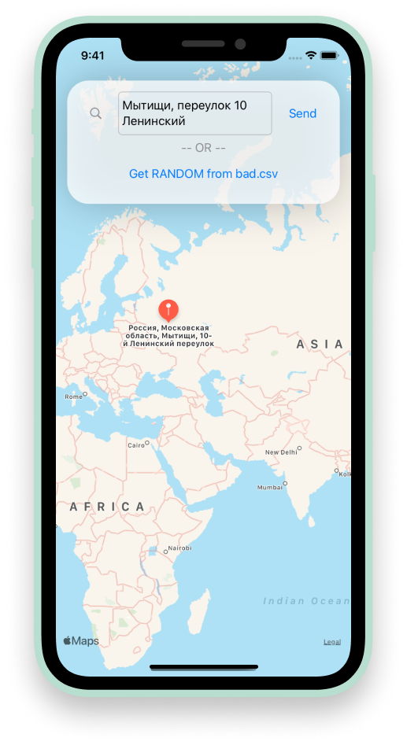

# Команда: ǝинɐʚεɐн

**Кейс: анализ геоданных**

Создание сервиса для предобработки адресов, в основе которого лежит идея суффиксного автомата из наиболее часто встречаемых подстрок.

## Repositories
- [WEB](https://github.com/asya-r/nazvanie)
- [BACKEND](https://github.com/1frag/nazvanie)

